<p align="center">
  
</p>

<h1 align="center">Apartamentos Rojo y Naranja</h1>

<p align="center">
  Plataforma de reservas para 4 apartamentos turísticos boutique en el centro histórico de Morella (Castellón).<br/>
  Reservas con disponibilidad en tiempo real, pago con Stripe, panel de propietario y chat híbrido con IA.
</p>

<p align="center">
  <a href="https://rojoynaranjaapartamentos.vercel.app"><strong>🔗 Demo en producción</strong></a>
</p>

---

## Índice

- [Sobre el proyecto](#sobre-el-proyecto)
- [Capturas de pantalla](#capturas-de-pantalla)
- [Stack técnico](#stack-técnico)
- [Arquitectura](#arquitectura)
- [Estructura del proyecto](#estructura-del-proyecto)
- [Puesta en marcha](#puesta-en-marcha)
- [Variables de entorno](#variables-de-entorno)
- [Testing](#testing)
- [Despliegue](#despliegue)
- [Estado del proyecto](#estado-del-proyecto)
- [Contexto](#contexto)

## Sobre el proyecto

**Apartamentos Rojo y Naranja** es una web de reserva directa para cuatro apartamentos turísticos (Rojo, Naranja, Plata y Ático Oro) situados dentro de la muralla medieval de Morella. Sustituye a portales de terceros (Booking, Escapada Rural) ofreciendo reserva directa sin comisiones, con toda la gestión — disponibilidad, pagos, comunicación con los huéspedes y administración del propietario — construida a medida.

Funcionalidades principales:

- 🏠 **Landing y fichas de apartamento** con fotos reales, precios, comodidades y SEO técnico (metadatos, JSON-LD, sitemap).
- 📅 **Motor de reservas** con calendario de disponibilidad en tiempo real, precios especiales por temporada y wizard de reserva en 2 pasos.
- 💳 **Pago online con Stripe Checkout**, webhook que confirma el pago y mueve la reserva a través de su ciclo de vida automáticamente.
- 👤 **Panel de usuario**: próximas reservas, historial, detalle con seguimiento de estado.
- 🛎️ **Panel de propietario**: KPIs del mes, calendario global de ocupación, gestión de reservas (confirmar/anular con reembolso automático), precios y bloqueos de calendario.
- 💬 **Chat híbrido IA/manual** en tiempo real (Supabase Realtime) entre huésped y propietario, con un asistente IA (Gemini) que puede responder automáticamente cuando el propietario activa el modo IA.
- 📧 **Emails transaccionales** (registro, pago recibido, reserva confirmada/anulada, nuevo mensaje) vía Gmail/Nodemailer.
- 🔐 **Autenticación y roles** (`user` / `owner`) con Supabase Auth, rutas protegidas por middleware y Row-Level Security en toda la base de datos.

## Capturas de pantalla

### Landing page

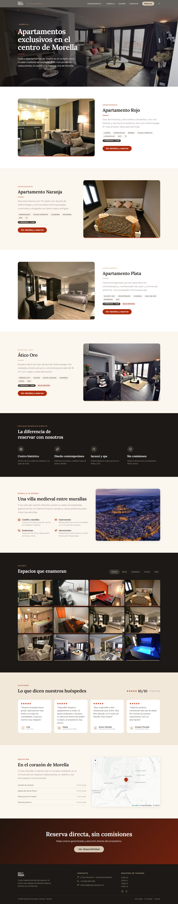

### Ficha de apartamento

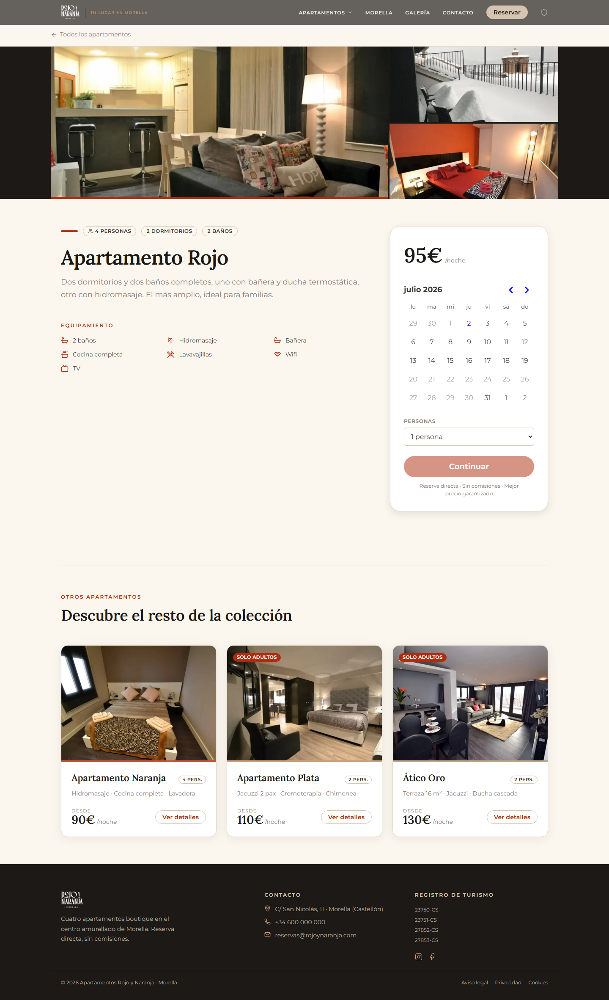

### Autenticación

<table>
<tr>
<td>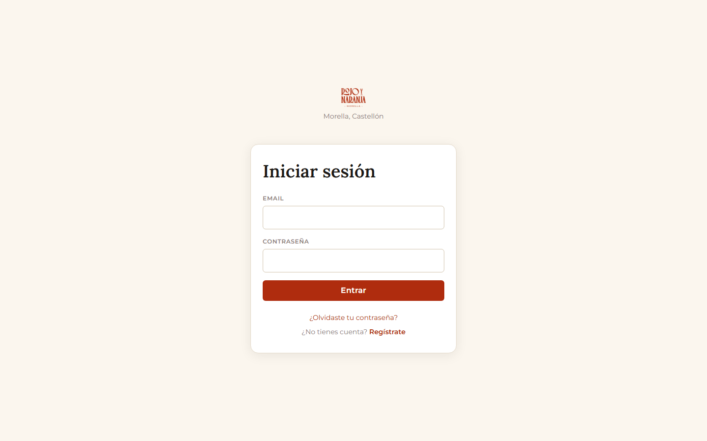</td>
<td>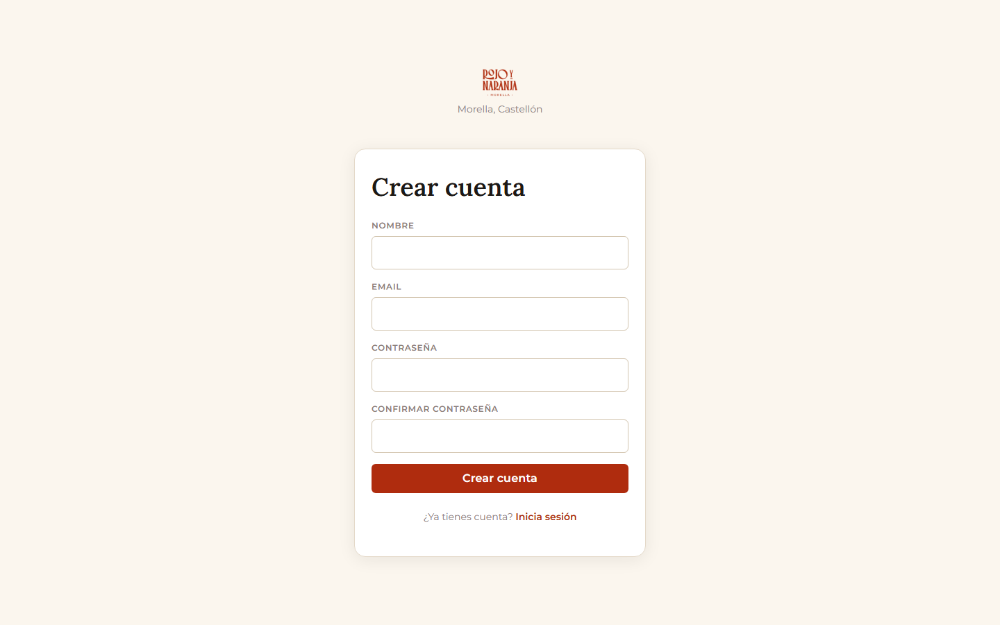</td>
</tr>
</table>

### Panel de usuario

<table>
<tr>
<td>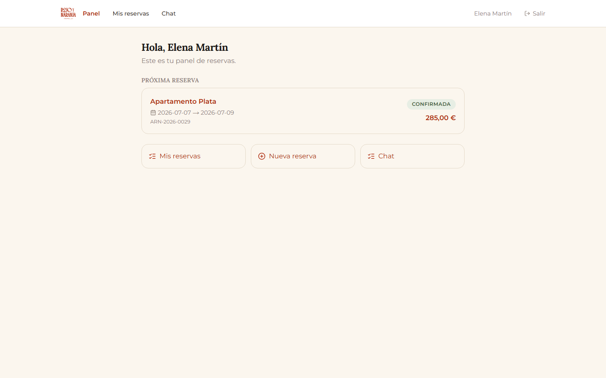</td>
<td>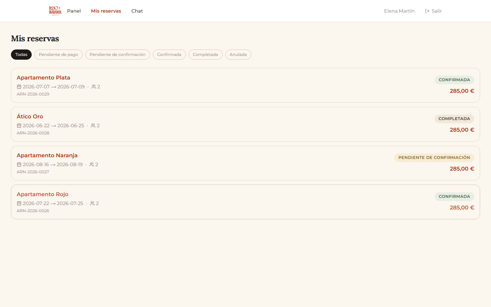</td>
</tr>
<tr>
<td>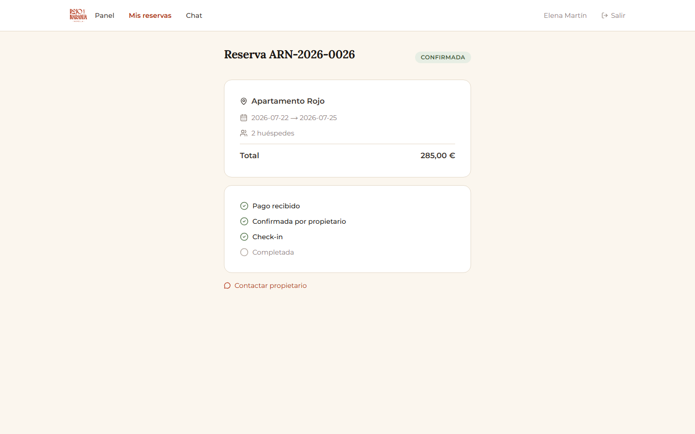</td>
<td>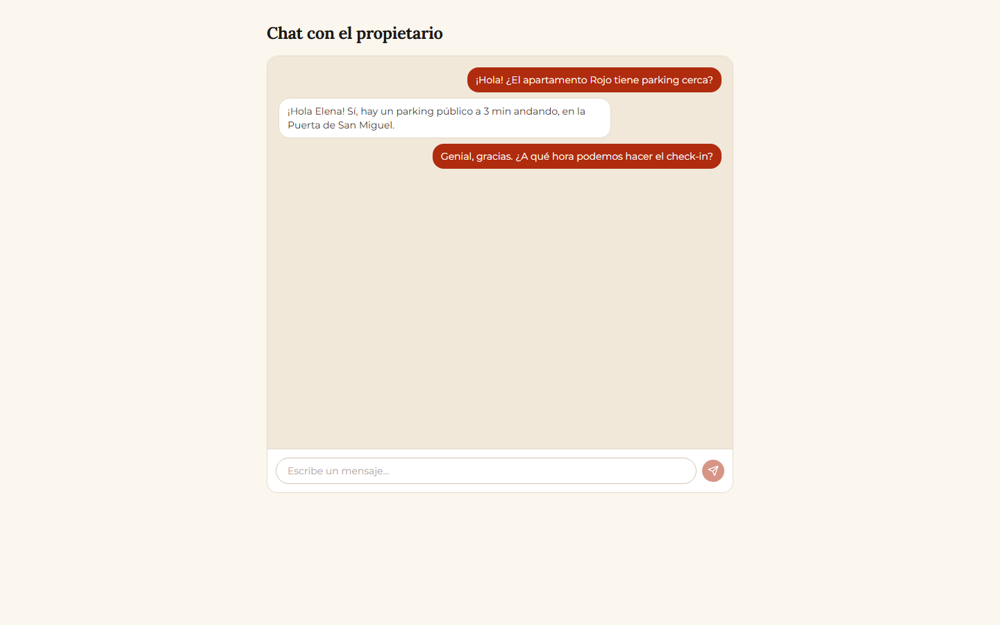</td>
</tr>
</table>

### Dashboard de propietario

<table>
<tr>
<td>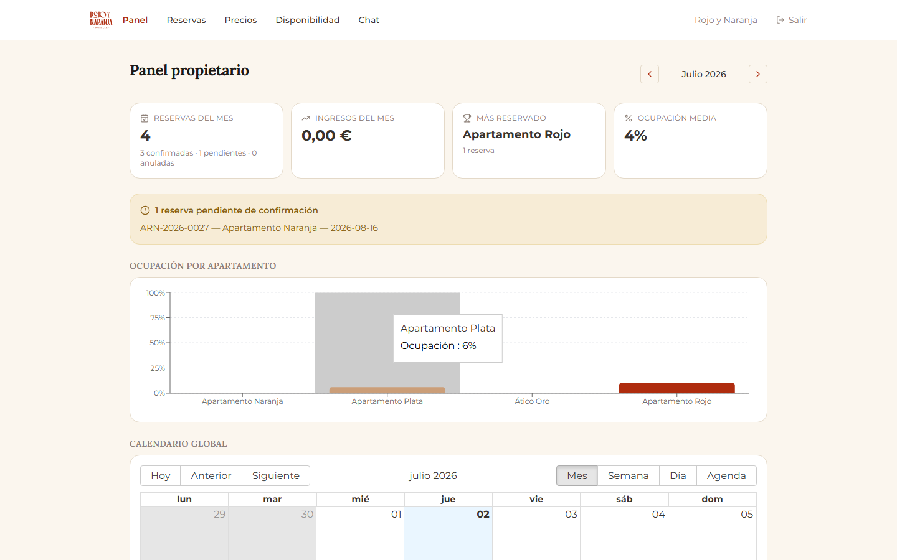</td>
<td>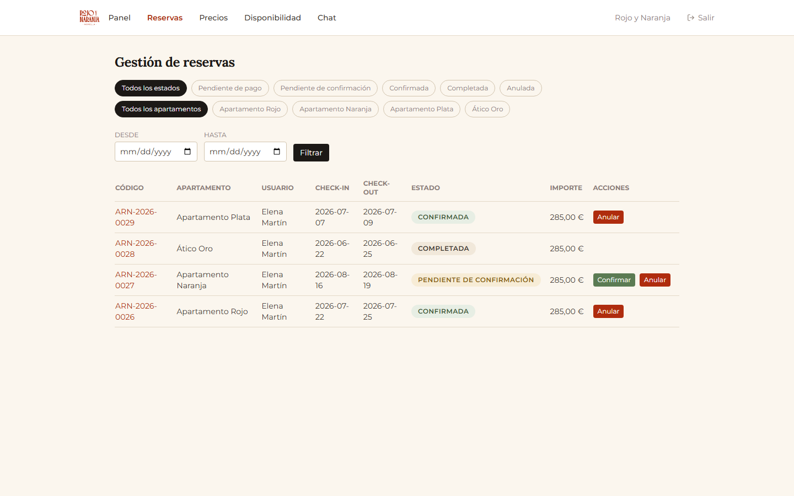</td>
</tr>
<tr>
<td>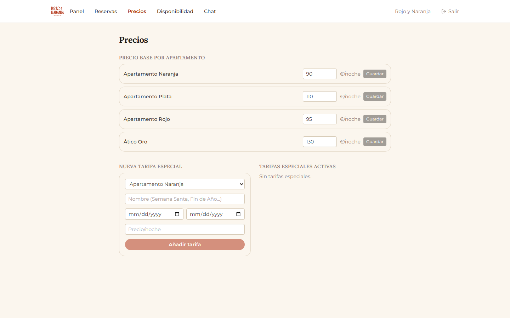</td>
<td>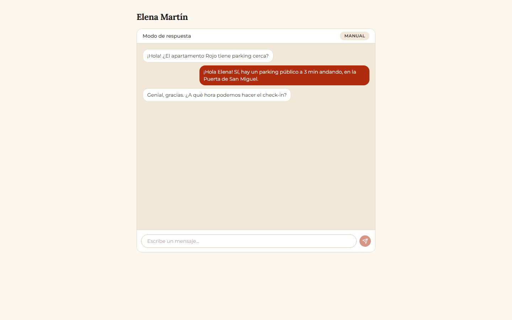</td>
</tr>
</table>

## Stack técnico

| Área | Tecnología |
|---|---|
| Framework | [Next.js 14](https://nextjs.org/) (App Router) |
| Base de datos y Auth | [Supabase](https://supabase.com/) (PostgreSQL + RLS + Realtime) |
| Pagos | [Stripe Checkout](https://stripe.com/) (state machine dirigida por webhook) |
| IA del chat | [Google Gemini](https://ai.google.dev/) (`gemini-flash-latest`, vía REST) |
| Email transaccional | Nodemailer (Gmail SMTP) + [React Email](https://react.email/) |
| Estado global | [Zustand](https://zustand-demo.pmnd.rs/) |
| Estilos | [Tailwind CSS](https://tailwindcss.com/) |
| Calendario y gráficas | react-big-calendar, react-day-picker, Recharts |
| Testing | [Vitest](https://vitest.dev/) (unitario) + [Playwright](https://playwright.dev/) (E2E) |
| Despliegue | [Vercel](https://vercel.com/) |

## Arquitectura

### Rutas

```
app/
├── (public)/          Landing y fichas de apartamento (sin autenticar)
├── (auth)/             Login, registro, confirmación, reset de contraseña
├── user/               Panel de huésped (rol "user" u "owner")
├── owner/              Panel de gestión del propietario (rol "owner")
└── api/                Rutas server-side (reservas, checkout, webhooks...)
```

`middleware.ts` protege `user/` y `owner/` comprobando la sesión de Supabase y el rol guardado en `profiles`.

### Dos clientes de Supabase

- `lib/supabase/client.ts` — cliente de navegador (clave `anon`, sujeto a RLS). Debe usarse como singleton.
- `lib/supabase/server.ts` / `lib/supabase/admin.ts` — clientes de servidor; `admin.ts` usa la `service_role` key y salta RLS para las operaciones que lo requieren (p. ej. escribir el `stripe_session_id` de una reserva ajena).

### Ciclo de vida de una reserva

```
pendiente_pago → pendiente_confirmacion → confirmada → completada
                                                ↘ anulada
```

El webhook de Stripe (`app/api/webhooks/stripe/route.tsx`) valida la firma, mueve la reserva a `pendiente_confirmacion` e inserta el pago de forma idempotente. El propietario confirma o anula manualmente desde su panel; anular reembolsa automáticamente en Stripe.

### Chat híbrido con IA

Cada fila de `conversaciones` tiene un flag `modo_ia` que el propietario puede activar por conversación (o de forma global). Con el modo activo, cada mensaje nuevo del huésped dispara `generarRespuestaIA()` (`lib/ia/chat.ts`), que llama a la API de Gemini con el contexto de los apartamentos y guarda la respuesta como un mensaje con `remitente: 'ia'`. Todas las partes reciben las actualizaciones vía Supabase Realtime.

### Tablas principales

| Tabla | Propósito |
|---|---|
| `profiles` | Extiende `auth.users`; guarda el rol (`user` / `owner`) |
| `apartamentos` | Los 4 apartamentos (Rojo, Naranja, Plata, Ático Oro) |
| `reservas` | Reservas, con código autogenerado (`ARN-AAAA-XXXX`), sesión de Stripe y estado |
| `pagos` | Pagos ligados al `payment_intent` de Stripe |
| `precios_especiales` | Tarifas de temporada/festivos por apartamento |
| `bloqueos_calendario` | Bloqueos manuales del propietario (mantenimiento, uso propio) |
| `conversaciones` | Hilos de chat, con el flag `modo_ia` |
| `mensajes` | Mensajes individuales (`remitente`: `user` / `owner` / `ia`) |

Row-Level Security está activo en todas las tablas: cada usuario solo ve sus propios datos; el propietario ve todo lo relacionado con los apartamentos.

## Estructura del proyecto

```
app/                  Rutas (App Router) y API routes
components/           Componentes React organizados por dominio (booking, chat, owner...)
lib/                  Clientes de Supabase/Stripe, helpers de email, lógica de IA
hooks/                Custom hooks de React
store/                Estado global (Zustand)
emails/               Plantillas de React Email
supabase/             Migraciones SQL y seed de los 4 apartamentos
e2e/                  Tests end-to-end (Playwright)
MemoryBank/           Especificación técnica detallada de cada módulo (M0-M14)
```

## Puesta en marcha

```bash
# 1. Instalar dependencias
npm install

# 2. Configurar variables de entorno
cp .env.example .env.local
# rellenar .env.local con tus claves (ver sección siguiente)

# 3. Aplicar el esquema y los datos iniciales en tu proyecto de Supabase
#    (supabase/migrations/*.sql y supabase/seed.sql)

# 4. Arrancar el servidor de desarrollo
npm run dev
```

La app queda disponible en `http://localhost:3000`.

Otros comandos útiles:

```bash
npm run build        # build de producción
npm run lint         # ESLint + Prettier
npm test             # tests unitarios (Vitest)
npm run test:e2e     # tests end-to-end (Playwright)

# Regenerar los tipos de Supabase tras un cambio de esquema
npx supabase gen types typescript --local > types/supabase.ts
```

## Variables de entorno

```bash
# Supabase
NEXT_PUBLIC_SUPABASE_URL=
NEXT_PUBLIC_SUPABASE_ANON_KEY=
SUPABASE_SERVICE_ROLE_KEY=

# Stripe
NEXT_PUBLIC_STRIPE_PUBLISHABLE_KEY=
STRIPE_SECRET_KEY=
STRIPE_WEBHOOK_SECRET=

# Gemini (chat híbrido IA)
GEMINI_API_KEY=
GEMINI_MODEL=gemini-flash-latest

# Email (Gmail SMTP vía Nodemailer)
GMAIL_USER=
GMAIL_APP_PASSWORD=

# Cuenta del propietario (recibe notificaciones de reservas y mensajes)
OWNER_EMAIL=

# App
NEXT_PUBLIC_APP_URL=http://localhost:3000
```

Para probar pagos en local hace falta además la [Stripe CLI](https://stripe.com/docs/stripe-cli) (`stripe listen --forward-to localhost:3000/api/webhooks/stripe`), ya que Stripe no puede llamar directamente a `localhost`.

## Testing

- **Unitarios** (`npm test`, Vitest): lógica de precios, fechas y reservas.
- **End-to-end** (`npm run test:e2e`, Playwright): autenticación, protección de rutas por rol, y el flujo crítico completo — crear reserva → pagar con Stripe (tarjeta de test) → webhook → confirmación del propietario.

## Despliegue

Desplegado en Vercel desde la rama `main`, con Stripe en modo test. El pipeline de despliegue no requiere pasos manuales adicionales aparte de configurar las variables de entorno del apartado anterior en el proyecto de Vercel.

## Estado del proyecto

Todos los módulos funcionales (M1–M13: setup, base de datos, autenticación, landing, reservas, pagos, paneles de usuario y propietario, chat con IA, emails, SEO y testing) están completos y verificados end-to-end. Pendiente para un "go-live" real: dominio propio y activar Stripe en modo live.

## Contexto

Este proyecto es el Proyecto Final del bootcamp de Full Stack Developer de [4Geeks Academy](https://4geeksacademy.com/).
